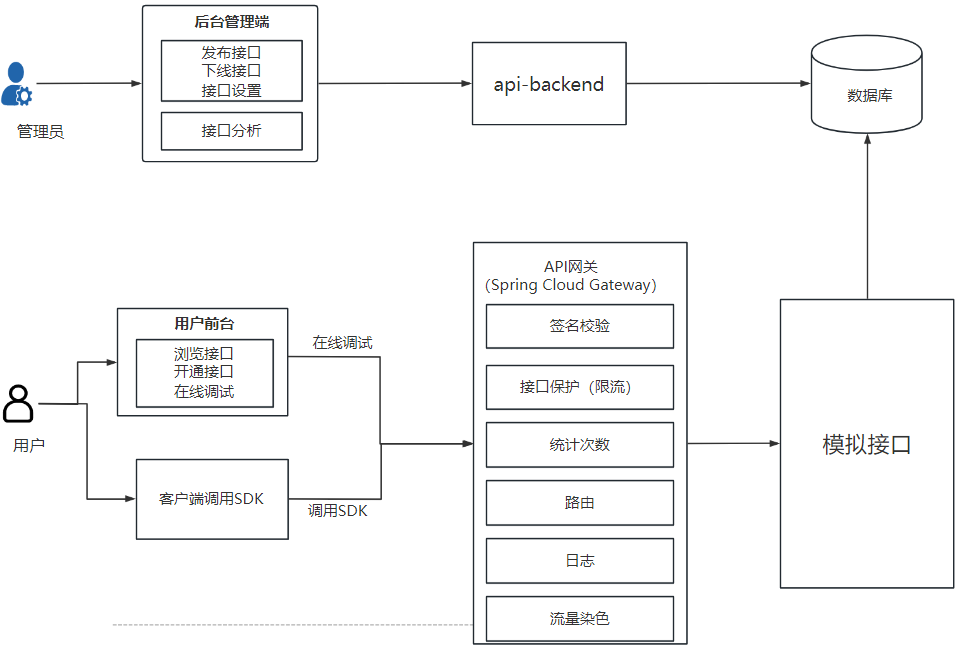

## 项目介绍
一个提供API接口供开发者调用的平台,管理员可以接入并发布接口，统计分析各接口的调用情况，用户可以注册登录，浏览接口及在线调试,也可以使用客户端SDK轻松在代码中调用。
> 在线体验地址：http://iamshaonian.top:8000/  
> 
> 前端项目地址：https://github.com/shaonianjzh/api-frontend
> 
> 后端项目地址：https://github.com/shaonianjzh/api-project
## 项目架构

## 后端项目模块说明
- api-backend：项目主体，包括用户，接口管理相关功能
- api-gateway: 网关服务，统一鉴权，接口统计等
- api-interface: 模拟接口
- api-common: 公共的封装类
- api-client-sdk: 客户端SDK，用于调用接口
## 技术栈及亮点
前端：
- React 
- Ant Design Pro脚手架
- Ant Design & Procomponents组件库
- Umi 4前端框架
- OpenAPI前端代码生成  

后端：
- Spring Boot
- MySQL
- MyBatis-Plus 及MyBatis X自动生成
- API 签名认证
- Spring Boot Starter（SDK开发）
- Dubbo实现子系统之间的调用（RPC、Nacos）
- Swagger + Knife4j 接口文档生成
- Spring Cloud Gateway 网关集中处理API签名校验，接口调用次数统计，路由转发，访问控制等
- Hutool、Apache Common Utils、Gson等工具库

